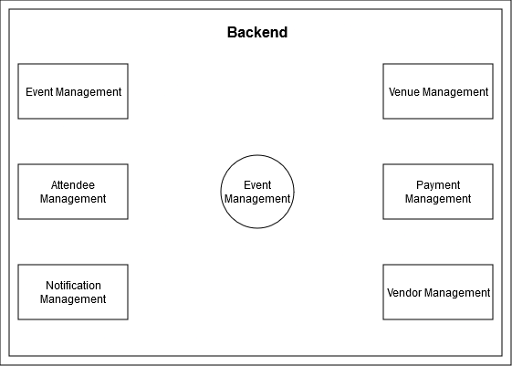
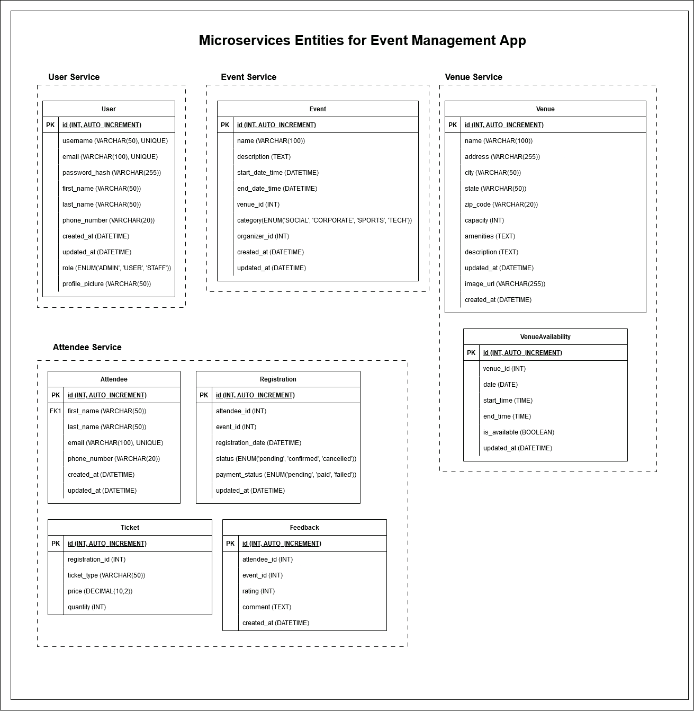
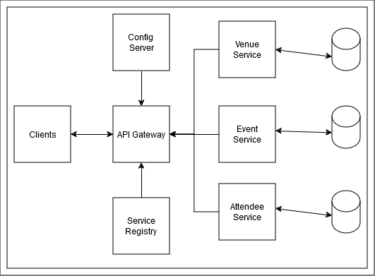

# Event Management Application

An Event Management App is built using spring boot following the below reference(actual implementations may differ 5%):

The Modules for the App may be as below

The Entities & their relations in each service

The approximate stucture of the App be:

## Lab Sessions breakup
### Day 1: 4th Dec 2024 ( Spring & spring boot referesher)
- Designing Modules, Entities, Backend Endpoints for Event Management App
- Lab : Hello, Spring Boot!
- Lab: Spring Boot Configuration
  - Injecting values from app.props & app.yml
  - Passing sensitive information from environment variables
  - Passing values through command line in spring boot app
- Lab: Swapping Embedded Server

### Day 2: 5th Dec 2024
- Lab 1: Creating Service Registry for EventsManagementApp
- Lab 2: Creating Event Service & adding as eureka client
- Lab 3: Event Service creation (CRUD) & testing in postman
   
### Day 3: 6th Dec 2024
- Lab 4: Creating Venue Service
- Lab 5: Externalizing Configuration using config server
- Lab 6: Open Feign Client Communication ( Booking Venue when event creation)
  
### Day 4: 9th Dec 2024
- Lab 7: Error Propogation using ErrorDecoder
- Lab 8: Adding Zipkin Tracing for Microservices Application
- Lab 9: Communication using REST Template ( Get event Details with venue)
- Lab 10: Using Mappers for Model to Entity & vice-versa
- Lab 11: Implementing Category Entity in event service

### Day 5: 10th Dec 2024
- Lab 12: Creating API Gateway for Events Management Application
- Lab 13: Implementing Circuit Breaker for Event Management Application
- Lab 14: Implementing Okta Authentication